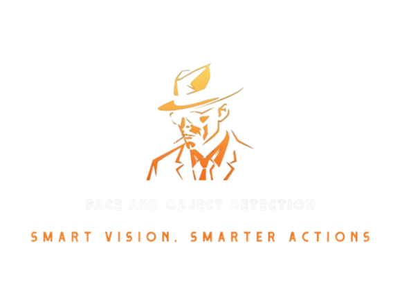

# SmartVision-AI

<p align="center">
  
</p>

A comprehensive face recognition and object detection system built with state-of-the-art deep learning technologies. This project combines real-time face recognition using DeepFace and object detection using YOLOv8, wrapped in a user-friendly web interface.

## 🌟 Features

- **Real-time Face Recognition**
  - High-accuracy face detection and recognition
  - Support for multiple faces simultaneously
  - Customizable confidence thresholds
  
- **Object Detection**
  - Real-time object detection using YOLOv8
  - Support for 80+ object classes
  - High performance and accuracy

- **User Management**
  - User profile creation and management
  - Photo upload and management interface
  - Secure embedding storage

- **Web Interface**
  - Modern, responsive design
  - Real-time video feed
  - Interactive user management
  - Drag-and-drop photo upload

## 🛠️ Technology Stack

### Backend
- Python 3.8
- Flask
- DeepFace
- YOLOv8
- OpenCV
- NumPy

### Frontend
- Bootstrap 5
- JavaScript
- HTML5/CSS3
- Font Awesome

## 📋 Prerequisites

- Anaconda or Miniconda
- CUDA-capable GPU (recommended)
- Webcam for real-time detection

## 🚀 Installation

1. **Clone the repository**
```bash
git clone https://github.com/NawyesHi/SmartVision-AI.git
cd SmartVision-AI
```

2. **Create and activate Conda environment**
```bash
conda env create -f environment.yml
conda activate smart_vision
```

3. **Install required packages**
```bash
pip install -r requirements.txt
```

4. **Initialize the application**
```bash
python app.py
```

## 📁 Project Structure

```
SmartVision-AI/
├── app.py              # Main Flask application
├── crop_face.py        # Face cropping utility
├── extract_embs.py     # Embedding extraction
├── face_recognition.py # Core recognition logic
├── static/            
│   ├── css/           # Stylesheets
│   ├── js/            # JavaScript files
│   └── pic/           # Images and assets
├── templates/          # HTML templates
├── data/              # User data storage
├── embeddings/        # Facial embeddings
└── requirements.txt   # Python dependencies
```

## 🎯 Usage

1. **Start the application**
```bash
python app.py
```

2. **Access the web interface**
- Open your browser and navigate to `http://localhost:5000`
- Click "Face Detection" to start real-time detection
- Use "Upload Photos" to manage users and their photos

3. **Managing Users**
- Create new users with photos
- Upload multiple photos per user
- Edit or delete existing users
- Reset embeddings if needed

## ⚙️ Configuration

### Face Recognition Settings
```python
metrics = [
    {"cosine": 0.25},
    {"euclidean": 15.0},
    {"euclidean_l2": 0.68}
]
```

### Object Detection Settings
```python
yolo_model = YOLO("yolov8n.pt")
detection_threshold = 0.3
```

## 🔧 Troubleshooting

Common issues and solutions:

1. **Camera Access Error**
   - Check camera permissions
   - Verify camera connection
   - Try different camera index

2. **GPU Memory Issues**
   - Reduce batch size
   - Use lighter model variants
   - Check CUDA installation

## 📈 Performance Optimization

- Use GPU acceleration when available
- Adjust detection thresholds for balance
- Optimize image resolution for performance

## 🤝 Contributing

1. Fork the repository
2. Create your feature branch
3. Commit your changes
4. Push to the branch
5. Create a Pull Request

## 📄 License

This project is licensed under the MIT License - see the [LICENSE](LICENSE) file for details.

## 🙏 Acknowledgments

- [DeepFace](https://github.com/serengil/deepface) for facial recognition
- [YOLOv8](https://github.com/ultralytics/ultralytics) for object detection
- [Flask](https://flask.palletsprojects.com/) for web framework
* Create a directory "data" where you can store images of people you want to recognize (make sure the faces are well visible and are looking at the camera.  If the faces captured are bad qualities this could affect the model performence)
* run the `crop_face.py` to crop the faces we want to recognize
* run the `extract_embs.py` to extract the embeddings of the cropped faces
* run the `face_recognition.py`
